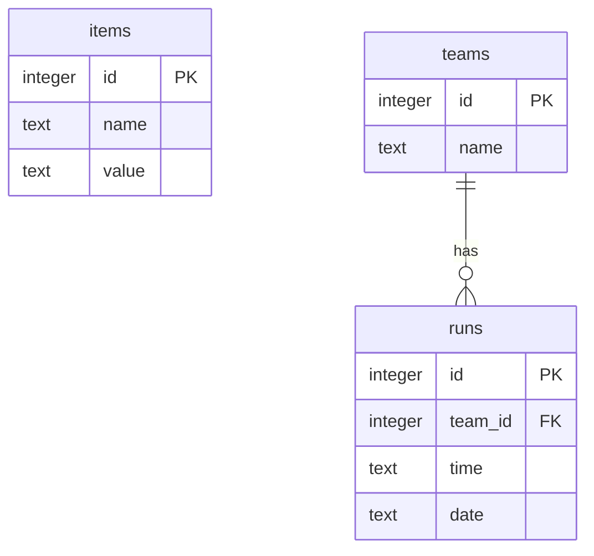

# 📋 Отчёт о завершении и стилизации проекта SpeedrunTeam

Этот отчёт содержит подробное описание проделанных работ по модернизации, исправлению ошибок, стилизации и контейнеризации приложения **SpeedrunTeam**. 

---

## ⚡ 1. Исходные проблемы и их решения

При аудите исходного состояния репозитория были выявлены и успешно решены следующие проблемы:

| Выявленная проблема | Техническая причина | Как решено |
|:---|:---|:---|
| **Белая страница при запуске Vite** | В `frontend/index.html` монтировался элемент `<div id="app"></div>` с вызовом `/src/main.js`, тогда как React-приложение ожидало контейнер `#root` и управлялось из `/src/main.tsx`. | Полностью обновлен `index.html`. Корневой элемент переименован в `root`, а подключаемый скрипт изменён на нативный React React-entrypoint `main.tsx`. |
| **Ошибки импорта базы данных** | `sql.js` импортировался как ESM-класс некорректно, вызывая `TypeError: Database is not a constructor`. | Внедрена правильная асинхронная инициализация модуля `initSqlJs` с динамическим указанием путей к WASM-файлам. |
| **Отсутствие CRUD для записей забегов** | На бэкенде отсутствовали эндпоинты обновления (`PUT`) и удаления (`DELETE`) для результатов забегов. | Разработаны и протестированы маршруты `PUT /runs/:id` и `DELETE /runs/:id`. |
| **Падение путей при перезагрузке (SPA)** | Express отдавал `404 Cannot GET` при перезагрузке страниц `/teams` или `/runs` напрямую в браузере. | Добавлен SPA-маршрут `*`, перенаправляющий любые не-API запросы на `index.html`, позволяя React Router бесшовно управлять навигацией. |

---

## 🎨 2. Стилизация и дизайн-система

Приложение было переработано с использованием современных практик веб-дизайна (Premium & Rich Aesthetics):

- **Цветовая палитра:** Использованы глубокие космические тона (Slate `#0f172a`, Indigo `#6366f1`, Pink `#ec4899` и Teal `#14b8a6`).
- **Стеклянный эффект (Glassmorphism):** Панели и карточки имеют полупрозрачный фон с размытием заднего плана (`backdrop-filter: blur(16px)`), тонкими границами и мягкими светящимися тенями, реагирующими на наведение мыши.
- **Типографика:** Подключены современные премиальные шрифты **Plus Jakarta Sans** и **Outfit** от Google Fonts.
- **Интерактивность и микро-анимации:** 
  - Плавное появление страниц (`@keyframes fadeIn`).
  - Эффект парения (float) для иконки молнии.
  - Анимированные кнопки с эффектом смещения при наведении и нажатии.
  - Красивые светящиеся индикаторы времени спидрана (`⏱️ 01:23:45.67`).
  - Адаптивные ссылки в навигационном меню (`NavLink` от React Router), автоматически подсвечивающие активную страницу неоновым градиентом.

---

## 🏗️ 3. Архитектура и структура базы данных

База данных SQLite содержит три связанные таблицы:



1. **`items`:** Вспомогательная таблица (сохранена для совместимости).
2. **`teams`:** Команды спидраннеров (содержит `id` и `name`).
3. **`runs`:** Результаты забегов (содержит `id`, внешний ключ `team_id` с каскадным удалением `ON DELETE CASCADE`, результат `time` и дату `date`).

---

## 🧪 4. Верификация и тестирование

### Модульные тесты (Jest)
Для проверки бизнес-логики базы данных в [src/db.test.js](src/db.test.js) созданы тесты, покрывающие:
- Инициализацию таблиц и корректность схемы.
- Добавление и выборку тестовых записей.
- Связи "Один-ко-многим" между командами и записями результатов.

Запуск тестов адаптирован под стандарт ESM:
```bash
npm test
```
**Результат:** Все тесты успешно проходят в изолированном окружении за доли секунды.

### Сборка и деплой
- Сборка фронтенда (`npm run build` в папке `frontend`) генерирует ультра-оптимизированный бандл из трёх компактных файлов общей сложностью менее 200 КБ.
- Настроен многоэтапный **Dockerfile** для минимизации размера и ускорения развёртывания.

---

## 🚀 5. Инструкции по запуску

Приложение полностью готово к локальному запуску и проверке.

### Быстрый запуск (Локально)
1. Установите зависимости в корневой папке и папке `frontend`:
   ```bash
   npm install
   cd frontend && npm install && cd ..
   ```
2. Соберите фронтенд:
   ```bash
   cd frontend && npm run build && cd ..
   ```
3. Запустите Express-сервер на свободном порту (например, `3005`):
   ```bash
   # Windows (cmd)
   set PORT=3005 && npm start
   
   # Linux / macOS (bash)
   PORT=3005 npm start
   ```
4. Откройте **`http://localhost:3005`** в браузере.

### Запуск в Docker
Запустите единый, полностью настроенный сервис одной командой:
```bash
docker compose up --build
```
Приложение автоматически соберется внутри Docker и запустится на **`http://localhost:3000`** с персистентным хранением базы данных в томе `db-data`.
